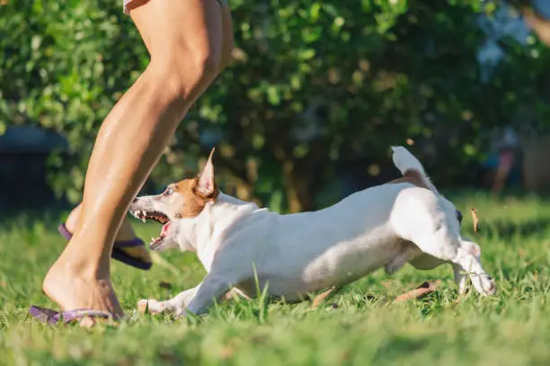
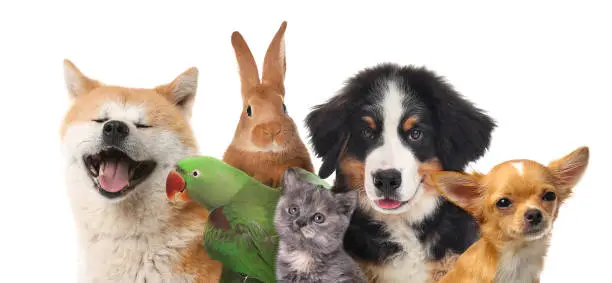

<!DOCTYPE html>
<html lang="nl">
<head>
  <meta charset="UTF-8" />
  <meta name="viewport" content="width=device-width, initial-scale=1.0"/>
  <title>Dierenliefde & Respect</title>
  
  
</head>
<body>

  <header>
    <h1>Dierenliefde & Respect</h1>
    
Voor een wereld waarin dieren met zorg en respect worden behandeld

  </header>

  <nav>
    <a href="#welkom">Welkom</a>
    <a href="#watjijkuntdoen">Wat jij kunt doen</a>
    <a href="#overons">Over ons</a>
    <a href="https://www.instagram.com/goed_omgaan_met_dieren_25" target="_blank">Instagram</a>
  </nav>

  <main>
    <section id="welkom">
      <h2>Welkom</h2>
      
De volgende stelling staat centraal: alle diersoorten hebben recht op een zodanig niveau van welzijn dat mishandeling en lijden geen rol meer mogen spelen...

      
We nodigen je graag uit om ons te volgen op Instagram:  
        <a href="https://www.instagram.com/goed_omgaan_met_dieren_25" target="_blank">@goed_omgaan_met_dieren_25</a>
      

      

        
        
        
      

    </section>

    <section id="watjijkuntdoen">
      <h2>Wat jij kunt doen</h2>
      <ul>
        <li>Overweeg adoptie in plaats van aankoop.</li>
        <li>Meld vermoedens van mishandeling bij de bevoegde instanties.</li>
        <li>Steun organisaties en individuen die zich inzetten voor dierenwelzijn.</li>
        <li>Informeer anderen over het belang van respect voor dieren.</li>
        <li>Geef huisdieren rust, ruimte en aandacht.</li>
      </ul>
      <a class="button" href="https://www.dierenbescherming.nl" target="_blank">Steun de Dierenbescherming</a>
      <a class="button" href="https://www.worldanimalprotection.nl/" target="_blank">World Animal Protection</a>
    </section>

    <section id="overons">
      <h2>Over ons</h2>
      
Wij zijn een groep scholieren die zich inzet voor het welzijn van dieren...

      
Door samen te werken geloven we dat we daadwerkelijk verandering kunnen realiseren.

    </section>

    <button class="tip-button" onclick="showFact()">Ontvang een Dierenfeit!</button>

    

      

      <button onclick="closePopup()">Sluit</button>
    

  </main>

  <footer>
    © 2025 Dierenliefde & Respect | Gemaakt door scholieren voor een betere wereld
  </footer>

</body>
</html>

